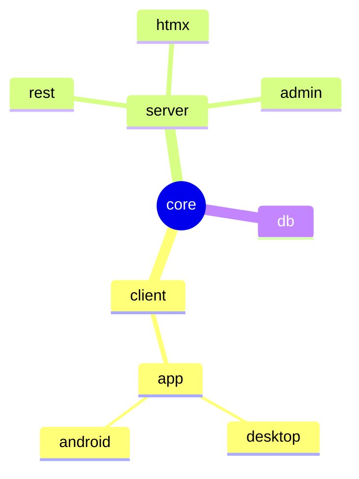

# Ktor Chat

This project provides a full example of a full-stack Ktor application using Compose Multi-platform, Amper, Exposed, 
Koin, and other bleeding-edge Kotlin libraries.

## Project Structure

The project consists of the following amper modules:

| module                           | description                                                  |
|----------------------------------|--------------------------------------------------------------|
| [core](core)                     | domain data objects, interfaces, and exceptions              |
| [server / db](server/db)         | exposed database schema types and repository implementations |
| [server / common](server/common) | common server functionality                                  |
| [server / rest](server/rest)     | ktor server REST implementation                              |
| [server / htmx](server/htmx)     | HTMX server implementation                                   |
| [server / admin](server/admin)   | admin service for making sensitive changes                   |
| [client](client)                 | common client library for interacting with the back-end      |
| [app / common](app/common)       | shared front-end application code                            |
| [app / android](app/android)     | android front-end application                                |
| [app / desktop](app/desktop)     | jvm desktop front-end application                            |

The dependencies of the modules flow towards the domain module: [core](core).

Below is a diagram of how the modules depend on one another:



Note, "common" module is implied for the server and app modules here.

## Running

There are multiple chat client implementations under `./chat-app-*` that can be executed independently 
with a mock environment, or with a server running.

Here is a list of the commands for running each program:

| application | main source                                    | gradle command                  |
|-------------|------------------------------------------------|---------------------------------|
| server-rest | `server/rest/src/io/ktor/chat/Application.kt`  | `./gradlew :server:rest:run`    |
| server-htmx | `server/htmx/src/io/ktor/chat/Application.kt`  | `./gradlew :server:htmx:run`    |
| desktop app | `app/desktop/src/main.kt`                      | `./gradlew :app:desktop:jvmRun` |
| android app | `app/android/src/io/ktor/chat/MainActivity.kt` | `./gradlew :app:android:jvmRun` |

### With Docker

If you'd like to run everything in a containerized environment:

Firstly, publish images locally using:
 - `./gradlew :server:rest:publishImageToLocalRegistry`
 - `./gradlew :server:admin:publishImageToLocalRegistry`

Now, you can run docker compose:
```bash
docker compose up
```